# infra

<!--
- AWSアカウントの作成
  - アカウントの作成
  - awscliの環境構築
  - SSOによる管理者権限を持つアカウントの作成
  - AWS Profileの設定
- Terraformの実行
  - Terraformの環境構築
  - S3上にバケットを作成する
  - Terraformの実行
- AWSリソースのセットアップ
  - Secrets Manager をセットアップする
  - AWS CodeBuild をセットアップし実行する
  - Amplify でフロントエンドを立ち上げる
  - 参考: AWS リソースの全体観
- モジュールのデプロイとリリース
  - OpenID Connect 用の IAM の作成
  -  ECR push を含む GitHub Actions ワークフローの作成
  - App Runner 上の更新状況の確認
-->

本書のコンセプトとして、できる限り本番開発に近い形で Rust 製のアプリケーションを実装していくというものがあります。これを達成するため、本書では AWS リソースの準備などもすべて行なった状態で作業を開始することをおすすめしています。このドキュメントでは、AWS 上にどのようにリソースを準備していくかについて説明します。

なお利用料金などは自己責任で管理をお願いいたします。仮に利用料金のトラブルが発生したとしても、本書は責任を負わないものとします。

## 1. AWS アカウントの作成

### アカウントの作成

AWS アカウントを作成してください。新規作成をおすすめします。

既存のアカウントをお持ちの場合はそれを利用してもよいかもしれませんが、VPC などのリソースを 0 からセットアップするようにできていますので、本書の実装内容が既存の設定を破壊しないかどうかご確認ください。場合によっては、お手元のリソースの状況を見ながらこのディレクトリの設定内容をご自身で調整していただく必要があるかもしれません。

### awscli の環境構築

AWS リソースを CLI で操作できるツールをインストールする必要があります。詳しい設定方法は[このドキュメント](https://github.com/aws/aws-cli?tab=readme-ov-file#installation)を参照してください。

macOS の場合、

```
brew install awscli
```

その他の OS のインストール手順は、下記サイトを参照してください。

- https://docs.aws.amazon.com/cli/latest/userguide/getting-started-install.html

### SSO による管理者権限を持つアカウントの作成

> [!NOTE]
> こちらの記事の手順に従うのもおすすめです。
>
> https://qiita.com/sakai00kou/items/086a12caa69a78c18f61

> [!TIP]
> 本書では、設定の手間などを省きたい関係から Administrator Access の権限を持つアカウントないしは IAM を使用する必要があります。強めの権限を持つものを利用する関係上、少しでも安全な方法を使えるとよいと判断し、AWS IAM Identity Center でユーザーを作成し、そのユーザーに Administrator Access の権限を付与するという手法を採用することにしました。
>
> しかし、設定が多少煩雑ではあるため、AWS にすでに慣れていて自身でそうした強めの権限のアカウントを管理できるので問題ない、という方はこの手順を踏む必要はありません。その場合はこの節を飛ばしていただいて構いません。

AWS IAM Identity Center をコンソール上で検索してアクセスしてください。そして、左のメニューから「ユーザー」を選択し、遷移した先の画面で「ユーザーを追加」をクリックします。


ユーザーを追加しましょう。ユーザー名やメールアドレスなどを入力します。メールアドレスの方は、後ほどアカウントセットアップのために必要な情報が送信されるので、必ず有効なものを指定してください。入力後、画面をスクロールするなどして表示できる「次へ」というボタンを押します。

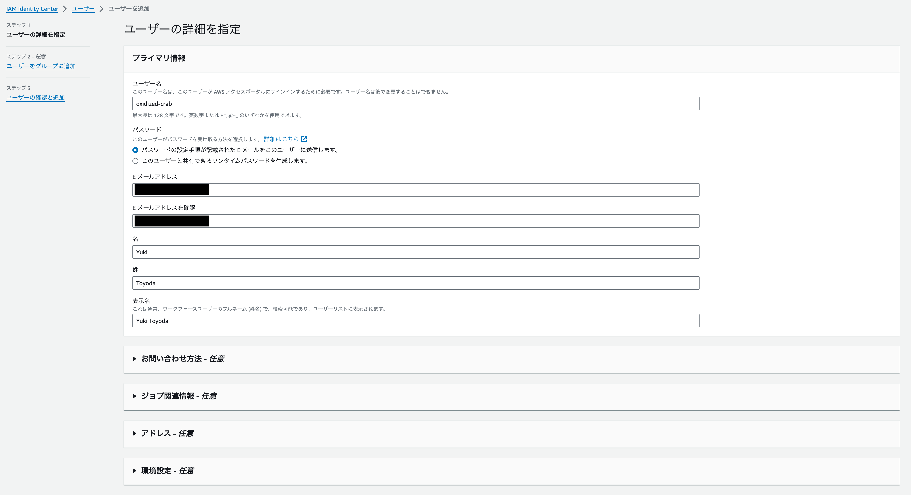

次のページに移動すると、グループを追加するかどうかを聞かれます。しかし今回はグループを使用しないので、そのまま「次へ」をクリックします。

最後の「ユーザーの確認と追加」のページで、内容を正しく入力できていることを確認し、「ユーザーを追加」ボタンを押してください。

先ほど入力したメールアドレスにメールが届いているはずです。メールを開いて「Accept invitation」ボタンを押します。ちなみにですが、「Your AWS access portal URL」は、このあと今回作成した SSO ユーザーでログインするために必要になる専用のアクセスポータルの URL です。

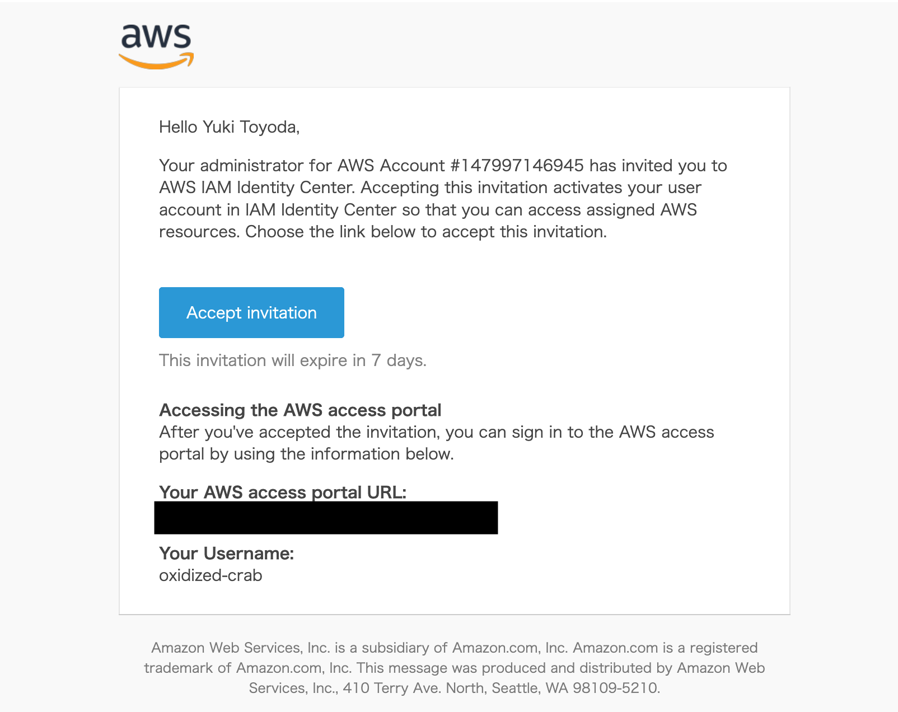

遷移先ではパスワードの設定を求められます。このパスワードを使ってログインすることになるので、メモなどを忘れないようにしてください。パスワードを入力し終わったら、「新しいパスワードを設定」を押します。

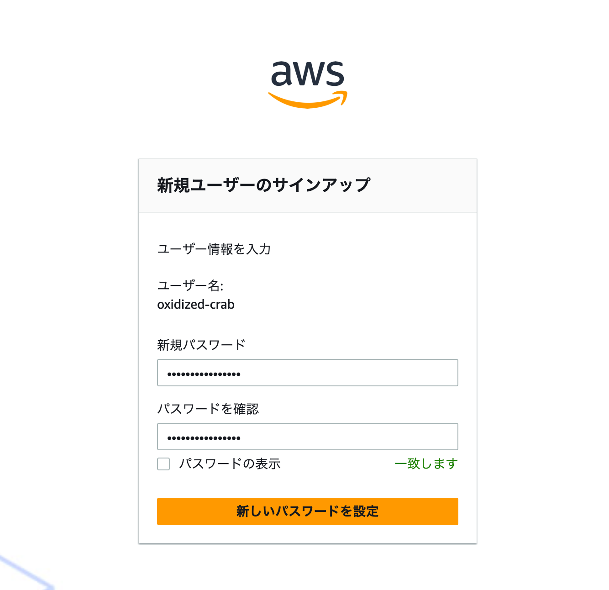

もう一度ログインするよう求められるので、先ほど作成した SSO ユーザーの「ユーザー名」と、先ほど設定したパスワードを入力してサインインします。

ログインに成功すると、次のような画面が表示されて MFA デバイスの登録を求められます。セキュリティを強化するためには必要な措置ですので、設定します。


> [!TIP]
> MFA デバイスはいくつかの方法で設定できます。とくにこだわりがなければ認証アプリを利用するとよいでしょう。詳しい設定方法は下記の記事にまとまっています。
> https://dev.classmethod.jp/articles/202307-set-up-aws-mfa-on-my-smartphone/

登録に成功すると、もう一度サインインを求められます。すべてのサインインに必要な情報を入力すると、次の画面が表示され、準備が完了となります。

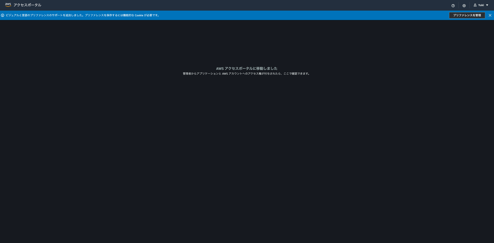

続いて、ルートユーザー（一番最初に作成した AWS アカウント）でコンソールに再度入ります。「IAM Identity Center > ユーザー」の画面を開くと、ユーザーを無事に登録できていることを確認できます。MFA デバイスも登録されたことを確認できます。


次に、作成した「oxidized-crab」というユーザーに Administrator Access の権限を与えます。「IAM Identity Center > AWS Organization: AWS アカウント」を開き、表示された画面の右上にある「ユーザーまたはグループを割り当て」を押します。その際、「管理アカウント（画面上だと helloyuki）」を選択しておいてください。


次に表示される画面で、「oxidized-crab」を選択します。「次へ」を押します。

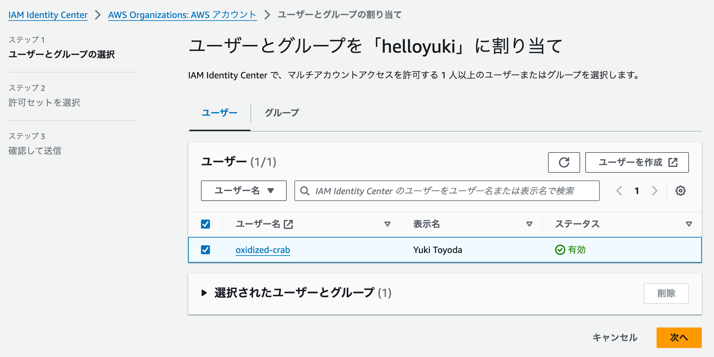

「AdministratorAccess」の許可セットを選択します。「次へ」を押します。


次に表示される確認画面で「送信」を押します。これで完了です。なお、ボタンを押下後少しだけ時間がかかります。

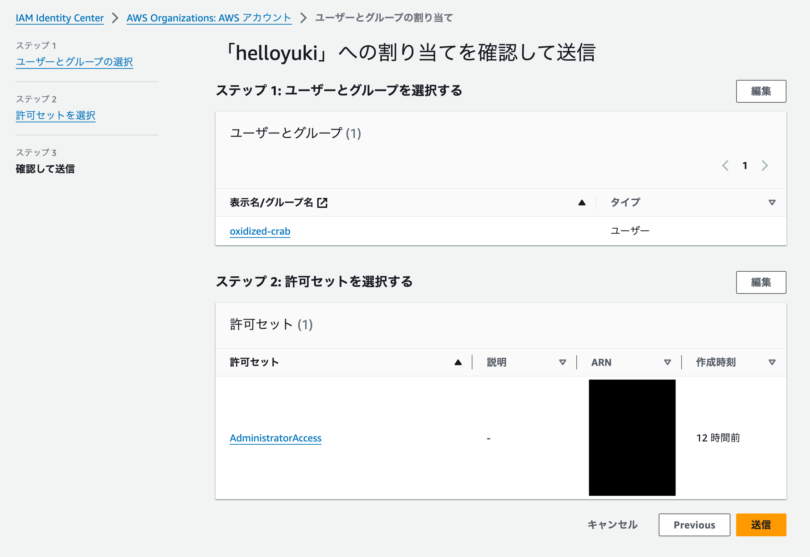

先ほどメールに付与されたアクセスポータルへの URL を探して、ページを開いてみましょう。すると、次のようなページを開けるはずです。開いた後、「AdministratorAccess」を押してみます。

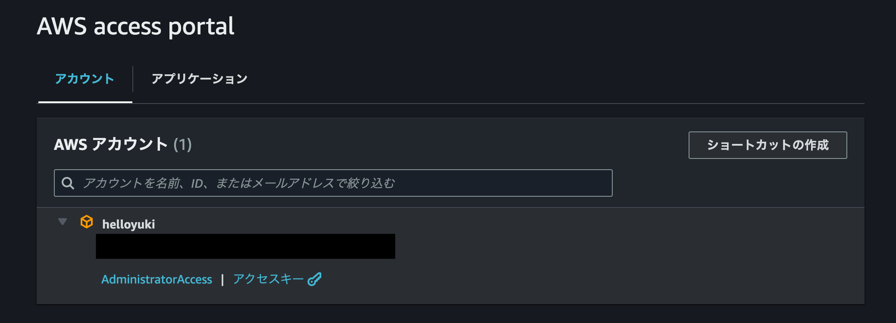

すると、AWS コンソールが開かれ、「oxidized-crab」ユーザーでログインできていることを確認できます。画面右上の自身のユーザー名が正しいことを確認できれば準備完了となります。


なお、アクセスポータルへの URL は定期的に利用することになりますので、ブックマークなどしておくとよいでしょう。

### AWS Profile をセットしておく

次に、作成した SSO ユーザーをいつでも利用しやすいよう、aws cli に記憶させておきます。この作業を行っておくと、Terraform での作業時やそのほかの付随する AWS に関連する作業時に便利ですので、ぜひ完了させておきましょう。

次のコマンドを実行します（awscli のインストールがまだの場合は、必ず行っておきましょう）。

```
$ aws configure sso
```

すると、次のようなプロンプトが出てきますので、順番に入力していきます。

```
SSO session name (Recommended): oxidized-crab
SSO start URL [None]: <メールで確認できるアクセスポータルのURL>
SSO region [None]: ap-northeast-1
SSO registration scopes [sso:account:access]:
```

入力すると、次のようなメッセージが表示されて、ブラウザが開きます。

```
Attempting to automatically open the SSO authorization page in your default browser.
If the browser does not open or you wish to use a different device to authorize this request, open the following URL:

https://device.sso.ap-northeast-1.amazonaws.com/

Then enter the code:
```

最初に認証コードが表示されますので、「Confirm and Continue」を押します。

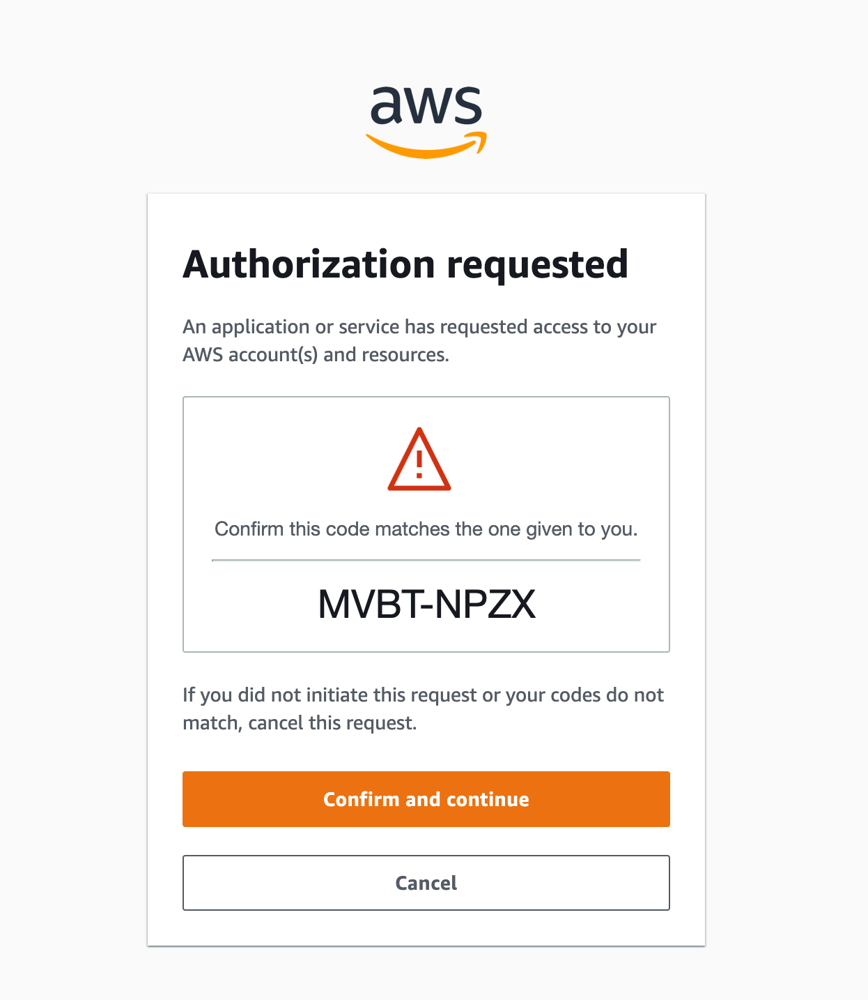

次にアクセス許可を求める画面が出るので、許可します。

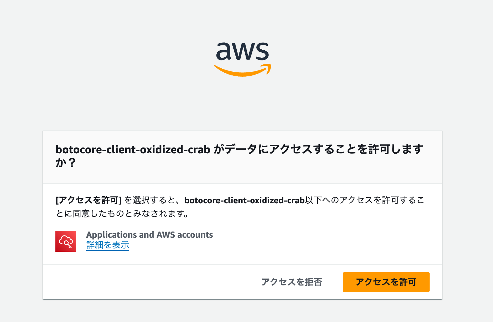

最後に「リクエストが承認されました」と表示されます。なお、この画面はのちに説明する `aws sso login` コマンドを入力するたびに毎回出会うことになります。


さて、ターミナルに戻ると次のようなメッセージが表示され、プロンプトがいくつか表示されて入力を求められます。これがいわゆる awscli の profile 情報に対応しています。今回は名前を「oxidized-crab」などとしておきましょう。

```
<認証コード>
The only AWS account available to you is: <AWS Accound ID>
Using the account ID <AWS Accound ID>
The only role available to you is: AdministratorAccess
Using the role name "AdministratorAccess"
CLI default client Region [None]: ap-northeast-1
CLI default output format [None]:
CLI profile name [AdministratorAccess-<AWS Account ID>]: oxidized-crab

To use this profile, specify the profile name using --profile, as shown:

aws s3 ls --profile oxidized-crab
```

実際に s3 ls するコマンドを実行してみるとうまくいくことを確かめられるはずです（といっても、まだバケットを何も作成してないのでレスポンスは空ですが）。

以上で、awscli の準備も完了となります。

## 2. リソースのセットアップ

### Terraform の環境構築

Terraform を使って AWS 上にリソースを構築するため、ご自身の環境で Terraform を利用できるようにする必要があります。

macOS では、

```
brew install terraform
```

それ以外の OS でのインストール手順は、下記サイトを参照してください。

- https://developer.hashicorp.com/terraform/tutorials/aws-get-started/install-cli

### S3 上にバケットを作成する

続いて、先ほどの AWS アカウントを使って S3 上にバケットを用意します。Terraform では state ファイルと呼ばれるものによって、現在のリソースの状態を保存して管理しています。この state ファイルを S3 上に作るために、先に S3 バケットを作成する必要があります。

awscli を使って S3 バケットを作成します。`--bucket`の後ろに、Terraform のステートを管理させたいバケット名を入力してください。なお、S3 のバケット名は AWS サービス全体かつグローバルで一意である必要があるため、考案したバケット名がすでに占有されている場合、その旨のエラーが表示される点に注意してください。

```
$ aws s3api create-bucket --bucket <自身のバケット名> --region ap-northeast-1 --create-bucket-configuration LocationConstraint=ap-northeast-1 --profile oxidized-crab
```

先ほどの s3 ls コマンドで作成できたかどうか確認してみると良いでしょう。

```
$ aws s3 ls --profile oxidized-crab
```

> [!TIP]
> なお、Terraform にすでに習熟しており自身で設定内容などを変更できる方であれば、ローカルの state を使用するように設定し直しても問題ありません。というのも、今回はインフラの構築をしてそのまま利用し続ける程度であり、何か更新作業などが書籍中で発生することはないためです。state に関する設定は、ルートの `main.tf` に記述されています。

次に、`main.tf`を編集します。下記のブロックが見られるはずなので、`bucket`を先ほど作成したバケット名に編集しておきましょう。

```
variable "aws_profile" {
  type    = string
  default = "oxidized-crab"
}

terraform {
  required_version = "~> 1"

  required_providers {
    aws = {
      source  = "hashicorp/aws"
      version = "~> 5"
    }
  }

  backend "s3" {
    bucket  = "<先ほど作成したバケット名を入力する>"
    region  = "ap-northeast-1"
    profile = "oxidized-crab"
    key     = "bookmanager.tfstate"
    encrypt = true
  }
}
```

### Terraform の実行

infra ディレクトリ内（このディレクトリ内）で Terraform コマンドを実行することで、AWS 上にリソースを構築することができます。

最初に初期化します。

```
$ terraform init
```

次のようなメッセージを確認できれば初期化は成功です。

```
Terraform has been successfully initialized!

You may now begin working with Terraform. Try running "terraform plan" to see
any changes that are required for your infrastructure. All Terraform commands
should now work.

If you ever set or change modules or backend configuration for Terraform,
rerun this command to reinitialize your working directory. If you forget, other
commands will detect it and remind you to do so if necessary.
```

次に、terraform plan を念の為実行しておき、変更される予定のリソースに誤りがないかどうかを確認します。

```
$ terraform plan
```

その後、apply をして AWS 上にリソースを構築しましょう。リソースの作成が始まると、初回は 10 分前後かかります。

```
$ terraform apply
```

一通り作成が終わると、たとえば App Runner に関連する失敗が出ます。これが出る場合は想定通りです。というのも、ECR 上に Docker イメージがまったく存在せず、プルする対象がないためです。この問題は後ほど解消します。

```
╷
│ Error: waiting for App Runner Service (arn:aws:apprunner:ap-northeast-1:147997146945:service/book-manager-backend/94b7882b9e304c1197d4dda26cae3611) create: unexpected state 'CREATE_FAILED', wanted target 'RUNNING'. last error: %!s(<nil>)
│
│   with module.app.aws_apprunner_service.backend_book_manager,
│   on app/main.tf line 61, in resource "aws_apprunner_service" "backend_book_manager":
│   61: resource "aws_apprunner_service" "backend_book_manager" {
│
╵
```

リソースを落とす場合は、destroy を用います。作業が終わった際や、本書を終えた際に destroy しておくことをお勧めします。

```
$ terraform destroy
```

最終的にアプリケーションを起動するためにいくつか準備が必要なリソースがあります。それらをセットアップしていきます。

### Secrets Manager をセットアップする

さて、このままではアプリケーションが動作しないので、設定をいくつか追加で行う必要があります。Secrets Manager を開いて、必要な環境変数を埋めていきます。Secrets Manager は「book-manager-secrets」という名前で作成されています。

#### データベース、Redis 関連設定

下記の変数は、データベースに接続するために必要なシークレット情報です。一部はデフォルトの値を Terrform 実行時に埋めさせるようにしています。

- DATABASE_HOST
- DATABASE_NAME: 「app」
- DATABASE_USERNAME: 「app」
- DATABASE_PASSWORD
- DATABASE_PORT: 「5432」

このうち、「DATABASE_HOST」と「DATABASE_PASSWORD」は自身で値を取得し、設定する必要があります。

DATABASE_HOST は、Amazon RDS（Aurora）の画面から取得する必要があります。すでに Terraform によって Aurora のインスタンスが「book-app-db」という名前で作成されています。このデータベースの「エンドポイント名」を取得してください。


続いて DATABASE_PASSWORD ですが、こちらは Terraform セットアップ時に付随して作成される Secrets Manager 上のデータベース接続のシークレット情報を取得する必要があります。Secrets Manager に「rds!cluster」で始まるシークレットが作成されているはずです。この画面上で「シークレットの値を取得する」ボタンを押すと、「password」という項目があります。この値を、元の Secrets Manager に写しておきましょう。

> [!WARNING]
> ランダムに生成されたパスワードに `%` が入っていないか注意してください。パスワードに `%` がある場合、psql（PostgreSQL のクライアント）を使ってデータベースに接続する際、上手に解釈できません。`%`を`%25`に置き換えてください（パーセントエンコードする必要がある、ということです）。


また、Elasticache Redis への接続の情報も書き込んでおく必要があります。該当するのは下記の変数です。

- REDIS_HOST
- REDIS_PORT: 6379

このうち、「REDIS_HOST」は自身で値を取得し、設定する必要があります。

Amazon Elasticache のページに遷移し、Redis OSS キャッシュのページを開きます。すると、「book-app-redis」という Redis が作成されているはずです。このページの「ノード」というテーブルにある「エンドポイント」の値が REDIS_HOST にあたります。ただ、ポート番号である`:6379`は削除して、シークレット情報に書き込みます。


以上で Secrets Manager の準備は完了です。

### AWS CodeBuild のセットアップし実行する

Aurora をプライベートサブネットに配置している関係で、プライベートサブネット内からアクセスしてデータベースの初期化と初期データのマイグレーションを行わなければなりません。この作業を行うために、AWS CodeBuild を使って両者を行います。

AWS CodeBuild には、Terraform を実行した時点ですでに必要なセットアップは整っています。なので、残りは少し調整を行なって実行すればデータベースの初期化とデータのマイグレーションが完了します。

なお、便宜的に CodeBuild のプライマリリポジトリは、書籍公式のリポジトリを向けてあります。これは、書籍内では 5 章あたりまで進行しないとマイグレーションスクリプトが揃い切らないためです。

CodeBuild の画面に移動し、「book-manager-database-migration」というビルドプロジェクトを探します。

該当のビルドプロジェクトの専用画面に遷移後、「ビルドを開始」のオレンジのボタンを押します。すると、裏でデータベースマイグレーションのスクリプトが実行されます。このビルドの実行は、一度成功したら二度以上実行する必要はありません。


### Amplify でフロントエンドを立ち上げる

フロントエンドのアプリケーションを動かすためには Amplify を利用するのが便利です。したがって、Amplify をセットアップしてフロントエンドアプリケーションを動作させられるようにします。

Amplify は Terraform ではセットアップしないようにしてあります。そのため、AWS コンソールの操作を通じて Amplify アプリケーションを起動しなければなりません。

Amplify での構築手順は下記の通りです。

1. 新しいアプリを作成ボタンを押す。
2. ソースコードプロバイダーを選択し、自身のリポジトリを設定する
3. アプリケーションの設定を行う
4. Amplify アプリケーションが作成されたことを確認する

#### 1. 新しいアプリを作成ボタンを押す。

画面右にある「新しいアプリを作成」ボタンを押します。

#### 2. ソースコードプロバイダーを選択し、自身のリポジトリを設定する

ソースコードプロバイダーは、「GitHub」を選択してください。GitHub の自身のアカウントへのサインインを求められますが、その画面でサインインをするか、「Continue」を押してください。


「リポジトリとブランチを追加」という画面に遷移するはずです。この画面で、ご自身の使用しているリポジトリと Amplify 側からの参照の対象としたいブランチ名（とくにこだわりがないようであれば「main」）を選択してください。また、「私のアプリケーションはモノレポです」にチェックを入れ、表示される「モノレポルートディレクトリ」に「frontend」と入力してください。


#### 3. アプリケーションの設定を行う

アプリケーションの設定画面に遷移後、作成したいアプリケーションの名前を設定しましょう。「rusty-book-manager」などとしておくのがおすすめです。


ビルドの設定については、「Edit YML file」というボタンを押し、下記の YAML の設定をコピー＆ペーストしてください。設定後、「フロントエンドビルドコマンド」や「出力ディレクトリをビルド」といった項目に自動で修正後の値が反映されているはずです。

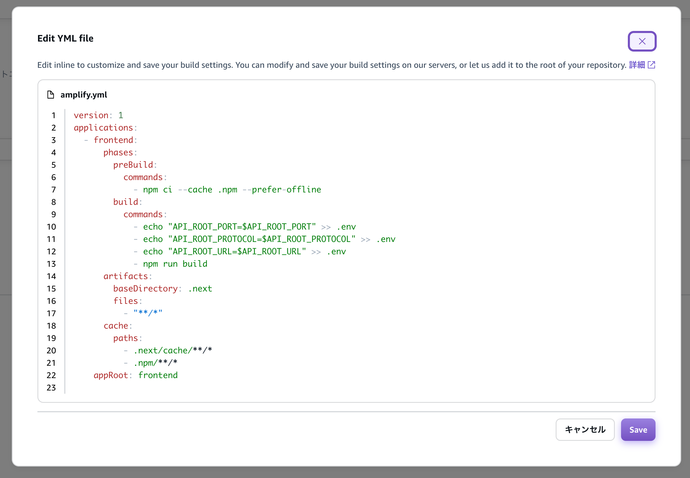

```yaml
version: 1
applications:
  - frontend:
      phases:
        preBuild:
          commands: ["npm ci --cache .npm --prefer-offline"]
        build:
          commands:
            - echo "API_ROOT_PORT=$API_ROOT_PORT" >> .env
            - echo "API_ROOT_PROTOCOL=$API_ROOT_PROTOCOL" >> .env
            - echo "API_ROOT_URL=$API_ROOT_URL" >> .env
            - npm run build
      artifacts:
        baseDirectory: .next
        files:
          - "**/*"
      cache:
        paths:
          - ".next/cache/**/*"
          - ".npm/**/*"
    appRoot: frontend
```

また、環境変数を設定します。画面下の「詳細設定」というアコーディオンを開きます。これは、Amplify 側から App Runner を参照するために必要になります。


- `API_ROOT_URL`: App Runner の「https」を抜いた URL を指定してください。
- `API_ROOT_PROTOCOL`: https
- `API_ROOT_PORT`: 443

次に遷移したページで、「保存してデプロイ」を選択します。

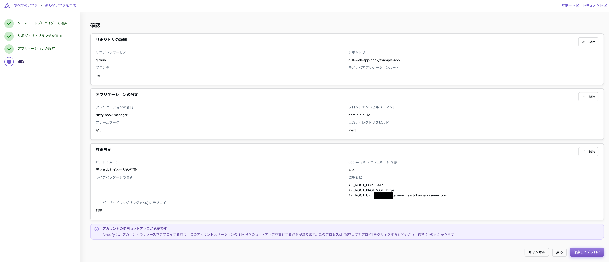

#### 4. Amplify アプリケーションが作成されたことを確認する

Amplify でアプリケーションを作成します。ビルドやデプロイにしばらく時間を要します。作成後は、作成されたアプリケーションの URL にアクセスするなどして表示確認を行うとよいでしょう。

## 4. モジュールのデプロイと画面の表示

GitHub Actions を使って、Rust の成果物を App Runner の環境にデプロイできるようにします。App Runner はすでに Terraform で構築した時点で、ECR リポジトリに何かしらの push があるとデプロイが走るようにセットアップされています。したがって、GitHub Actions では、タグをトリガーとして ECR 用の Docker イメージのビルドと、作成したイメージの push までを行うように設定します。

### OpenID Connect 用の IAM の作成

下記の資料を参考に、専用のロールを作成します。

- [「GitHub Actions で OIDC を使用して AWS 認証を行う」](https://zenn.dev/kou_pg_0131/articles/gh-actions-oidc-aws)

### ECR push を含む GitHub Actions ワークフローの作成

最初に、GitHub にて環境変数などを設定する必要があります。ご自身の作業中のリポジトリの「Settings」ページを開き、「Secrets and variables > Actions」ページを開きます。

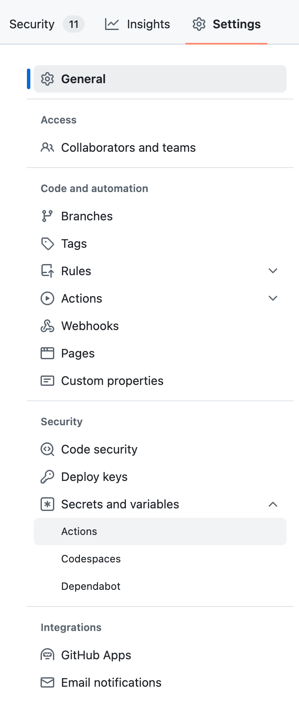

開いたページにて、Secrets に下記を指定してください。

- Secrets
  - `AWS_ACCOUNT_ID`: ご自身の AWS アカウント ID を取得して入力してください。

続いて、ご自身の作業中のリポジトリに、`.github/workflows`に`deploy_app.yaml`というファイルを作成し、そのファイルに下記の設定コードを記述します。このワークフローは `release-` というプレフィックスを持つタグが切られ、push されるとそのタイミングで発火します。処理としては、ECR 向けのイメージのビルドとイメージへのタグ付け、ならびに ECR リポジトリへのプッシュを行います。

```yaml
name: push image to ECR
on:
  push:
    tags:
      - "release-*"

permissions:
  id-token: write
  issues: write
  pull-requests: write
  contents: read

env:
  AWS_PROFILE_NAME: terraform-bookmanager

jobs:
  plan:
    runs-on: ubuntu-latest
    timeout-minutes: 15

    steps:
      - name: Checkout
        uses: actions/checkout@v2

      - name: Setup AWS Credentials
        uses: aws-actions/configure-aws-credentials@v3
        with:
          role-to-assume: arn:aws:iam::${{ secrets.AWS_ACCOUNT_ID }}:role/github-actions-oidc
          aws-region: ap-northeast-1

      - name: Make aws profile
        run: |
          aws configure set aws_access_key_id ${AWS_ACCESS_KEY_ID} --profile ${{ env.AWS_PROFILE_NAME }}
          aws configure set aws_secret_access_key ${AWS_SECRET_ACCESS_KEY} --profile ${{ env.AWS_PROFILE_NAME }}
          aws configure set aws_session_token ${AWS_SESSION_TOKEN} --profile ${{ env.AWS_PROFILE_NAME }}

      - run: aws sts get-caller-identity --profile ${{ env.AWS_PROFILE_NAME }}

      - uses: aws-actions/amazon-ecr-login@v1
        id: login-ecr
        with:
          role-to-assume: arn:aws:iam::${{ secrets.AWS_ACCOUNT_ID }}:role/github-actions-oidc
          aws-region: ap-northeast-1

      - name: Install cargo-make
        uses: taiki-e/install-action@v2
        with:
          tool: cargo-make

      - name: Push an image for backend to ECR
        env:
          REGISTRY: ${{ steps.login-ecr.outputs.registry }}
          REPOSITORY: "book-manager-backend"
          IMAGE_TAG: ${{ github.sha }}
        run: |
          cargo make ecr-build
          docker tag example-app-app ${{ env.REGISTRY }}/${{ env.REPOSITORY }}:${{ env.IMAGE_TAG }}
          docker push ${{ env.REGISTRY }}/${{ env.REPOSITORY }}:${{ env.IMAGE_TAG }}
          docker tag example-app-app ${{ env.REGISTRY }}/${{ env.REPOSITORY }}:latest
          docker push ${{ env.REGISTRY }}/${{ env.REPOSITORY }}:latest
```

ECR 上のイメージタグについては、常に `github.sha` を取得したものと、`latest` の 2 つが作成されるようになっています。現場などでは latest 運用は推奨されていないかもしれませんが、書籍都合の簡単化のためにこのようにしています。

作成後、試しに `release-trial` のようなタグを切るなどして、実際に AWS 認証が通りワークフローを完了できるか、ECR リポジトリにイメージが push されたかなどを確認してみてください。

### App Runner 上の更新状況の確認

ECR にイメージが push されると、App Runner 側も同時に更新が走るように設定されています。一応 App Runner のタイムスタンプを確認し、デプロイできていないようであれば自身で App Runner のビルドを回し直すなどの対応を行なってください。

なお、Amplify 側はとくに作業の必要はありません。

## 最後に

以上でデプロイパイプラインの構築の説明は終了となります。少々作業が込み入っていますが、リリースまでしっかりやり切りたい場合はぜひ、他の参考資料なども見ながら進めていただけると幸いです。
